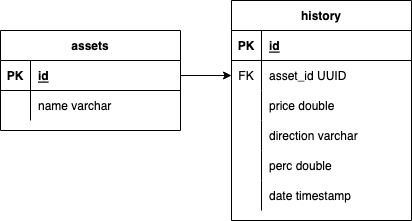

# Binance Parser

---

## Usage

<b><u>POST</u></b> http://localhost:8080/asset/add

Request body:

```json
{
	"symbol": "BTCUSDT"
}
```

<b><u>GET</u></b> http://localhost:8080/asset/history?symbol=BNBUSDT&limit=10&offset=0

Query Parameters:

-   symbol (str)
-   limit (int)
-   offset (int)

## Deployment

1. "make up" in ./deployment directory
2. ???
3. Profit

## Requirements

-   Docker Compose
-   GNU Make

## DB schema



## Basics

<b></b>
Пакеты:

-   <b>historyManager</b>

    -   Содержит логику управления историей котировок. Основные сущности:

        -   <b>HistoryManager</b>: являет собой управляющую структуру для истории котировок конкретной пары валют.

        Поле Asset определяет, к какой именно паре валют относится содержимое поля EntriesBuffer.

        Слайс EntriesBuffer хранит записи истории котировок. Его основная цель - уменьшение количества запросов в БД на запись. По прошествии времени bufferUnloadInterval (настраиваемо) этот буффер выгружается в storage (одним запросом), а затем очищается.

        Содержит поле storage с интерфейсом HistoryStorage для отделения логики от конкретной реализации хранилища. Во-первых, для отвязки от конкретной реализации, во-вторых, для возможности написания тестов, независимых от наличия подключения к БД (например).

        Использование: запуск горутины HistoryManager.StartHistoryBufferProcessor() и использование метода HistoryManager.AddHistoryEntry(HistoryEntry) для добавления в буффер записи.

        Потокобезопасность всех операций обеспечивается использованием мьютекса.

        -   <b>HistoryEntry</b>
        -   <b>Asset</b>
        -   <b></b>
        -   <b></b>

-   <b>parser</b>
-   <b>server</b>

## historyManager package

Содержит логику управления историей котировок. Основные сущности:

### HistoryManager

Являет собой управляющую структуру для истории котировок конкретной пары валют. Агрегирует записи истории, сохраняет в хранилище и, при необходимости, достает оттуда.

Поле Asset определяет, к какой именно паре валют относится содержимое поля EntriesBuffer.

Слайс EntriesBuffer хранит записи истории котировок. Его основная цель - уменьшение количества запросов в БД на запись. По прошествии времени bufferUnloadInterval (настраиваемо) этот буффер выгружается в storage (одним запросом), а затем очищается.

Содержит поле storage с интерфейсом HistoryStorage для отделения логики от конкретной реализации хранилища. Во-первых, для отвязки от конкретной реализации, во-вторых, для возможности написания тестов, независимых от наличия подключения к БД (например).

Использование: запуск горутины HistoryManager.StartHistoryBufferProcessor() и использование метода HistoryManager.AddHistoryEntry(HistoryEntry) для добавления в буффер записи. При необходимости достать из хранилища записи, используется метод HistoryManager.GetEntriesAsJSON(limit, offset), возвращающий сериализованный json, готовый к отправке клиенту.

Потокобезопасность всех операций обеспечивается использованием мьютекса.

### HistoryEntry

Представляет одну запись истории котировок.

### Asset

Преимущественно используется для идентификации валютной пары, содержит ее ID в хранилище.

### DBHistoryStorage

Реализация интерфейса HistoryStorage на основе PostgreSQL, использует пулер соединений. Креды для подключения читаются из среды (пакет env).

## parser

### Parser

Синглтон для парсинга котировок.

Использование: для начала работы, после инициализации конструктором NewParser, запустить горутину parser.Fetch() в цикле. Добавление отслеживаемых пар валют используется метод parser.AddAsset(symbol).

Принцип работы: при инициализации конструктором, происходит заполнение мапы HistoryManagersMap отслеживаемыми валютными парами из реализации хранилища AssetStorage (все по аналогии с HistoryStorage). Метод parser.Fetch() проходит по этой мапе, формирует один запрос на BinanceAPI, а затем добавляет результаты запроса в буффер с записями истории в соответствующие HistoryManager.

## server

Содержит все, связанное с http-сервером: роутинг, мидлварь для логирования, хендлеры. Идемпотентность добавления валютной пары обеспечена, проверка валидности валютной пары - тоже. 